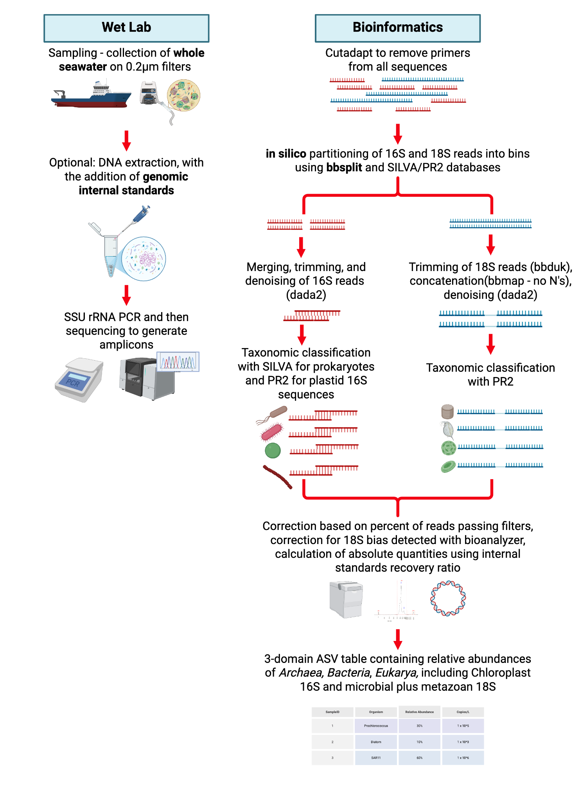

# Summary

Plankton have been quantified for many years, and through quantifying them we have learned that they govern many globally important biogeochemical cycles [@falkowski2008]. Traditionally this was done by using methods such as counting cells under a microscope, however, these methods are usually time costly, require significant training and expertise, and in the end it is impossible to discern many taxa from one another within the realm of larger plankton, let alone the small prokaryotic cells, which in the end, are the most abundant plankton in the ocean. While methods such as microscopy are still extremely useful and relevant, the discovery of 16S ribosomal RNA gene [@woese1977] led to cloning and sequencing of the 16S gene using conserved broad-range PCR primers [@lane1991]. The advent of high throughput sequencing made it possible for us to utilize these markers to relatively quantify plankton communities in the ocean.

These plankton communities have been analyzed by PCR of many markers which now span many regions (V4, V4 - V5, V9 to name a few) of the 16S (prokaryotes), 18S (eukaryotes), genes and then sequencing the resulting amplicons. Many of these markers only robustly target one group of organisms (i.e V9 and Eukaryotes). This has meant that any one discipline who generates amplicons by targeting such a specific gene, is limiting their view of what organisms were present in their sample and therefore subsequent, important ecological interactions that are happening within that sample. This limits the understanding of the system, and is akin for example, to an ecologist attempting to understand the Savannah by only counting grass eating herbivores, and ignoring the grass itself, as well as the predators which eat the grass eating herbivores.Therefore, to truly understanding microbial life through the analysis of PCR generated amplicons, we advocate for the use of the 515FY 926R universal primers [@parada2016] which capture both 16S and 18S, giving us taxonomic distributions of Archaea, Bacteria and Eukaryotes, as well as 16S plastid derived sequences. These primers have been tested against 300 million metagenomes [@mcnichol2021] as well as mock communities [@parada2016; @yeh2021], which showed that they not only performed the best at capturing the most plankton sequences in the ocean [@mcnichol2021] but they are also quantitative [@parada2016; @yeh2021; @joneskellett2024]. Therein lies the reason we have developed this software, because traditional denoising amplicon pipelines are not equipped to deal with both 18S and 16S sequences, more of which will be discussed below.

# Statement of need
While sequencing both 16S and 18S amplicons in the same sequencing run is extremely powerful, when bioinformatically processing these reads, one must take care to properly address the unique aspects of this data. Firstly, 16S and 18S V4-V5 amplicons are different lengths. This presents two inherent issues. The first is that while traditionally, when sequencing on a 2x250 bp or 2x300 bp platform 16S forward and reverse reads are able to be trimmed for quality and the merged by overlapping the inside ends of the sequence with a small overlap in the middle of the amplicon. Given that most 18S sequences are greater in length than 500bp (if in a perfect world both reads were high quality and didn’t have to be trimmed which is almost never the case) an overlap will simply not occur with forward and reverse reads of 250 bp in length. Therefore, when applying standard pipelines to this primer pair, the vast majority of 18S reads are thrown away.  Another caveat of having both 16S and 18S amplicons in the same run is that no one database serves to assign taxonomy robustly to both prokaryotes and eukaryotes. Therefore, we have designed a bioinformatic pipeline that splits reads into 16S and 18S bins using bbsplit [@bushnell2014] and then uses DADA2 [@callahan2016] to trim and merge 16S sequences, but, trims the 18S reads using bbduk and then concatenates them using bbmap [@bushnell2014], resulting in little to no loss of 18S reads in the data. These separate ASV tables are then assigned taxonomy with SILVA [@quast2013] (16S) and PR2 [@guillou2013] (16S chloroplast and 18S) for a taxonomically resolved dataset. These tables are then merged back together as the data is now comparable. Another issue with the differing lengths between 16S and 18S is that there is an innate sequencing bias that occurs against longer reads on all sequencing platforms [@yeh2021]. To combat this, we employ a correction based off a bioanalyzer trace to correct against sequencing bias. Finally, in more and more amplicon studies [@joneskellett2024; @bei2025; @williams2026; @gifford2020], internal standards are being used to accurately quantify amplicons by using spike in genomic internal standards during DNA extraction. Therefore we have also incorporated a script to normalise the amplicon data if internal standards are used. This pipeline is implemented in snakemake [@koster2012] to make it both efficient and reproducible, with a number of customizable attributes embedded in a tidy configuration file, representing a workflow that can be used easily to robustly process amplicon data generated using universal primers that incorporates internal standards. Finally, if the user wishes to run the pipeline with the default settings, it will produce ASVs which are directly comparable to GRUMP, and their ASV Hash (a unique taxonomic identifier) can simply be copy pasted to the GRUMP explore for global analysis (https://www.nathanlrwilliams.com/GRUMP/). None of these features currently exist elsewhere.

# State of the field                                                                                                                  

Currently there exist many pipelines that make processing amplicon data easy. These include Nextflow [@ditommaso2017] and Galaxy [@afgan2018], to name a few. These pipelines often include a combination of QIIME 2 [@bolyen2019] and DADA2 [@callahan2016] to merge, denoise and to remove chimeras from the amplicon data. They then assign taxonomy often using either SILVA [@quast2013] or PR2 [@guillou2013].

# Software design

The design of this software has been fit to snakemake, a workflow management system that allows for a easily run, easily scalable and easily reproduced pipeline. It is centered around a tutorial webpage (https://www.nathanlrwilliams.com/eASV-Pipeline-Tutorial/) which guides users through installation, and then creates a config file that sets the users parameters, and lets the software know where their raw data is stored to avoid redundant copies of files. Once this tutorial form is complete, it prompts the user to download a zip file containing all the information the pipeline needs to run. The user can upload this to their project file (created at the beginning of the tutorial) and then immediately run the pipeline. 

{width="90%"}

The pipeline will automatically run a number of scripts. These include cutadapt (ref) which uses no-indels to disallow insertions or deletions in primers. We allow for a 20% mismatch in primers, because the 515Fy 926R primers are degenerate. In this step, if the primer is not found, the sequence is deleted. The primer sequences are derived from the config file. 
After this, the snakemake runs bbsplit. This step is incorporated to split the 16S and 18S reads. This works by mapping reads against reference databases using bbsplit (Brian Bushnell 2010), which then partitions mixed amplicons into PROK (16S) and EUK (18S) bins. Bbsplit builds a k-mer index of reference sequences (derived from silva and PR2). It breaks reads into k-mers and looks up these k-mers in the  reference database and then performs a fast alignment. We use an identity and coverage of 0.30 as we only need broad domain separation and this avoids us losing real reads due to divergence). It then compares scores across databases and picks the best-scoring reference set. The outputs are separate FASTQ files for 16S and 18S as well as a per-sample and per-run fraction of EUK vs PROK reads (used for later corrections).
Once bbsplit has processed, the pipeline then runs a set of prokaryote scripts (02-PROKs) and eukaryote scripts (02-EUKAs). The core prokaryote scripts include a number of housekeeping scripts such as P00-create-manifest, P01-import and P02-visualise-quality-R1-R2. These scripts are mostly housekeeping scripts. P00 labels the samples. P01 imports the fastq files as a single QIIME2 artifact. At this point they are paired because we can merge them later, and P02 produces a figure to visualize read quality in the QIIME2 viewer. After the housekeeping, DADA2 is used to trim, merge and denoise the 16S sequences. We use a fixed trim length of 220 forward and 180 reverse for quality trimming. After trimming, DADA2 then merges forward and reverse reads and then removes chimeras. This Infers exact amplicon sequence variant (ASV) sequences. DADA2 results are then exported as a table, to be used in later corrections. Finally comes the two classification scripts, P05-calssify-eASVs, P09-split-mito-chloro-PR2-reclassify. These two scripts use the QIIME2 Naïve Bayes classifier to assign taxonomy based on k-mer similarity and  probability. P05-classify-eASVs the 16S amplicons using the latest version of SILVA. P09-split-mito-chloro-PR2-reclassify pulls out the chloroplasts and reclassifies them with PR2. This will be what is saved in the final output, however, the silva assigned chloroplasts remain stored for later use if desired.
Simultaneously the pipeline runs the eukaryotic scripts which include again, some preliminary housekeeping scripts, E00-create-manifest-viz, E01-import, and E02-visualize-quality_R1-R2. E00 labels the samples. E01 imports the fastq files as a single QIIME2 artifact. At this point they are paired because we merge them later, and E02 produces a figure to visualize read quality in the QIIME2 viewer. The next script is E03-bbduk-cut-reads which trim all reads to a fixed length (for comparability to our large oceanic metabarcoding database GRUMP, can be changed in the config if desired). After this, the E04-fuse-EUKs-withoutNs is run. Here bbmap fuses the forward and reverse reads together because 18S amplicons are too long to merge. It uses pad=0 so that there are no Ns or gaps inserted between reads. Therefore, if the forward trim length is 220 bp and the reverse is 180 bp then the output should be 400 bp. The next key script is E08-DADA2, which removes sequencing errors and chimeras. Finally, the last scripts are for classification. E10-classify-seqs classifies the eukaryotic ASVs with SILVA, and E14-split-metazoans-PR2-alternative-class with PR2. We primarily use PR2 assigned data.
In the final stages of the pipeline, we run a script to assign a finer resolution taxonomy to cyanobacteria using ProPortal, and then we merge the 16S and 18S data tables together. Within this merge step we add a calculation that accounts for the bias in sequencing against the longer 18S sequences (see mathematics section). Once this merging has completed, we run a script to tidy the data frame in an organized long format with columns for each level of taxonomy and information on what database was used to assign taxonomy for that sequence. Both the corrected data, and the uncorrected data are included for use at the users discretion. A script is then run to add a correction for the internal standards, adding a column which is absolute copies of that ASV per unit of measurement. See Mathematics section for calculations. The final script generates a html report of the read recovery from raw reads to the final product, detailing where reads were lost so that users can troubleshoot easily, should their data not be to their liking. This report also includes simple summaries of the data, including a bar chart of the top 10 groups at each taxonomic level, as well as an assessment of how the internal standards performed if they were included.

# Research impact statement

Whilst we have tweaked our pipeline and made it fit into the snakemake architecture, its core has already been used in many large projects, the main one of these being the Global rRNA Universal Metabarcoding of Plankton Database.

# Mathematics

## 18S Correction

Two corrections are made to both 16S and 18S rRNA ASV tables before they are merged. The first adjusts for a known bias against longer 18S rRNA sequences during Illumina sequencing [@yeh2021], and the second adjusts for random variations in sample quality using the DADA2 output statistics [@callahan2016]. Briefly, for the first adjustment, a measure of the quantity of each 16S and 18S is taken with a BioAnalyzer, Tapestation or equivalent. These fractions were calculated as:

$$
f_{16S} = \frac{C_{16S}}{C_{16S} + C_{18S}}
$$

$$
f_{18S} = \frac{C_{18S}}{C_{16S} + C_{18S}}
$$

where $f_{16S}$ and $f_{18S}$ are the respective rRNA fractions, and $C_{16S}$ and $C_{18S}$ are the measured concentrations in $\mathrm{nmol\,L^{-1}}$.

These are considered the "expected" outcome from the sequencing run. The same fractions were then calculated after the BBSplit step, which sorts 16S rRNA and 18S rRNA sequences into separate bins in the analysis pipeline, as shown in \autoref{fig:pipeline}, using the number of 16S and 18S rRNA sequences measured by the sequencer. These sequence fractions were calculated as:

$$
q_{16S} = \frac{N_{16S}}{N_{16S} + N_{18S}}
$$

$$
q_{18S} = \frac{N_{18S}}{N_{16S} + N_{18S}}
$$

where $q_{16S}$ and $q_{18S}$ are the respective sequence fractions, and $N_{16S}$ and $N_{18S}$ are the total numbers of 16S and 18S sequences.

A correction factor for each sequence type was calculated as:

$$
CF_{16S} = \frac{f_{16S}}{q_{16S}}
$$

$$
CF_{18S} = \frac{f_{18S}}{q_{18S}}
$$

The second adjustment is for random variations in sample quality and uses the DADA2 output statistics. The total number of non-chimeric reads is divided by the initial number of input reads to calculate the ratio of reads that passed DADA2 chimera detection:

$$
r_{\mathrm{DADA2}} = \frac{N_{\mathrm{nonchimeric}}}{N_{\mathrm{input}}}
$$

The output read abundance for each sample was then corrected as:

$$
A_{\mathrm{corrected}} =
\frac{A_{\mathrm{read}} \times CF_{d}}{r_{\mathrm{DADA2}}},
\qquad d \in \{16S, 18S\}
$$

where $A_{\mathrm{read}}$ is the observed read abundance and $CF_d$ is the correction factor for the corresponding 16S or 18S sequence type. This correction has been validated by comparing a selection of samples from GRUMP that had vastly different correction factors, and re-sequencing them in their own pool, calculating their new correction factor (this bias occurs based on the contents of the pool and the individual sequencing run), which showed strikingly similar results (\autoref{fig:corrections}).

{width="85%"}

## Internal Standard Correction

The internal-standard correction follows the approach described by Jones-Kellet et al. [-@joneskellett2024]. This normalization is applied to the bias corrected data. Copies per unit of ASVs are calculated with the internal standards in two steps. First, the recovery ratio was calculated as:

$$
x = \frac{c_{\mathrm{IS}}}{s}
$$

where $x$ is the recovery ratio, $c_{\mathrm{IS}}$ is the number of internal-standard reads recovered by sequencing after bias correction and $s$ is the number of internal-standard genome copies per liter added to the sample. The abundance of each target ASV was then calculated as:

$$
\mathrm{ASV\ copies\ L^{-1}} = \frac{c_{\mathrm{ASV}}}{x}
$$

where $c_{\mathrm{ASV}}$ is the number of reads recovered for the target ASV after bias correction. The number of internal-standard genome copies added, $s$, was calculated from the mass and genome length of the standard as:

$$
s =
\frac{m_{\mathrm{IS}} \times 6.022 \times 10^{23}}
{660 \times L_{\mathrm{IS}} \times 10^{9}}
$$

where $m_{\mathrm{IS}}$ is the total internal-standard DNA added in nanograms, $L_{\mathrm{IS}}$ is the internal-standard genome length in base pairs, $6.022 \times 10^{23}$ is Avogadro's constant, $660$ is the approximate average molar mass of one base pair in grams per mole, and $10^{9}$ converts nanograms to grams. This equation gives the number of genome copies represented by the added DNA mass; expressing $s$ as copies per unit.

# Citations

# AI usage disclosure
Generative AI was used to create the tutorial webpage, which assists users to create their config file. It was also used to debug code, to assist in pushing and pulling our fixes to github, and create the python script that generates the final html report for the pipeline. Finally, AI was used to help convert our original manuscript from a word doc to a markdown file.

# Acknowledgements
We first would like to thank Mike Lee for the idea of using bbsplit to separate the 16S and 18S sequences. We would also like to thank past Fuhrman lab members including Yi-Chen Yeh, David Needham, xxx for their ideas in the process of developing the original pipeline.

# References
